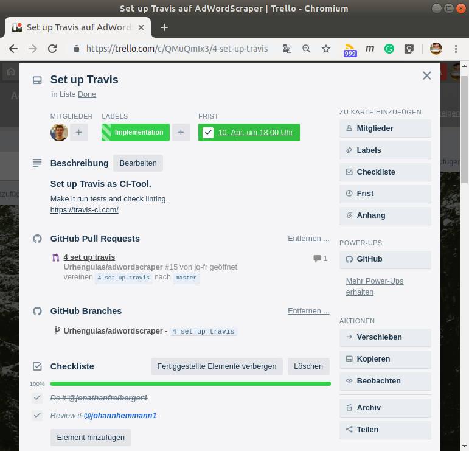

# Collaboration Guideline

The Adwordscraper is no open source project. It is developed in the context of the "STS_Correctiv_Project".


## Table of content

- [Table of content](#table-of-content)
- [What do you need?](#what-do-you-need)
- [Task Management](#task-management)
  - [Trello Board structure](#trello-board-structure)
  - [Trello Card conventions](#trello-card-conventions)
- [Task filing](#task-filing)
- [Git Branching Model](#git-branching-model)
  - [Master branch](#master-branch)
  - [Feature branches](#feature-branches)
  - [Pull requests](#pull-requests)
    - [Pull request template](#pull-request-template)
    - [Conditions to pass](#conditions-to-pass)
  - [Commit messages](#commit-messages)
  - [Git magic](#git-magic)
- [Testing](#testing)
- [Style guideline](#style-guideline)
- [Travis CI](#travis-ci)


## What do you need?

To start collaborating you need four things:
- access to the private GitHub-Repo [`Urhengulas/adwordscraper`](https://github.com/Urhengulas/adwordscraper)  
  _(you probably have that, if you are reading this ;D )_
- access to the Trello Board [`correctiv - CODE/Adwordscraper`](https://trello.com/b/wHsCHEqk/adwordscraper)
- working installation of [Python (version: 3.6+)](https://www.python.org/about/gettingstarted/)
- working installation of [Docker (version: 18.09.5)](https://docs.docker.com/install/)


## Task Management

For task distribution and tracking we are using [`Trello`](https://trello.com/) together with its [`GitHub-Extension`](https://trello.com/power-ups/55a5d916446f517774210004/github).  
Every contributor picks and manages her tasks on her own. Always communicate with people if you assign/mention them somewhere.

### Trello Board structure

We have 5 columns:

| Column | Which tasks should be there |
| :--- | :--- |
| Backlog| _Tasks which are not urgend_ |
| Todo| _Tasks which should be worked on next_ |
| In Progess| _Tasks which have people (and a deadline) assigned_ |
| To review| _Finished tasks which need to be signed off_ |
| Done| _Finished tasks_ |

### Trello Card conventions

  
_Example Trello Card_

- choose a headline with max. four words
- describe the object of the card extensively
- assign responsible people
- split up the smaller steps into a tasklist _(mention responsible people)_
- add a deadline
- add labels
- [ GitHub-Extension ]
  - append branches/ pull requests
  - add who shall review a pull request to Trello AND GitHub


## Task filing

To file a new Task (or Issue) just create a new card in Todo or Backlog, depending on its urgency.
Try to apply the [Trello Card conventions](#trello-card-conventions).


## Git Branching Model

Our branching model is inspired by [Git Flow](https://nvie.com/posts/a-successful-git-branching-model/), but we are using a clearly reduced version.

### Master branch

We have a `master` branch, which aims to be stable all the time.  
**Never push directly to master!** _(there are only rare exceptions)_

### Feature branches

Besides that we have feature branches.
- they are always the equivalent to a Trello Card
  - please because of that link the branches to the trello card
- they are named like the Trello Card (including the unique Id)  
  e.g. `4-set-up-travis`  
  _(see end of url in picture above)_

### Pull requests

To merge features into master you have to create a pull request.  
Requirements:
- needs to be reviewed from at least one other developer (ensured by [GitHubs Branch protection rules](https://help.github.com/articles/defining-the-mergeability-of-pull-requests/))
- only do 'merge'-pull requests _(no 'squash and merge', or 'rebase and merge')_

#### Pull request template

We provide a [**Pull request template**](PULL_REQUEST_TEMPLATE.md) which automatically gives you a framework for your pull request message.

#### Conditions to pass

- resolve all merge conflicts
- provide tests for all new features
- make sure your branch passes all tests
- make sure your branch follows the style guidelines
- adapt documentation to the changes

### Commit messages
I would suggest to read this article ["How to Write a Git Commit Message"](https://chris.beams.io/posts/git-commit/) to everyone.  
TL;DR
1. Limit the subject line to 50 characters
1. Capitalize the subject line
1. Do not end the subject line with a period
1. Use the imperative mood in the subject line

   e.g. `"Create test_parse_for_filter in test_scraper.py"`  
   instead of [`"created test_scraper.py. created unit test test_parse_for_filter()"`](https://github.com/Urhengulas/adwordscraper/commit/4500a242e4561bcaa86b4564befab5f00baebf57)

### Git magic 
(aka. rebasing and force pushing)

You are free to do all git-vodoo as long as you follow the ["Golden Rule of Rebasing"](https://www.atlassian.com/git/tutorials/merging-vs-rebasing#the-golden-rule-of-rebasing) _(which also applies to the other git magic)_
> Don't do it on public branches!

## Testing

For testing we are using [pytest](https://docs.pytest.org/en/latest/).  
All the tests are in the `tests` module. For one `xxx.py`-file there is one `test_xxx.py`-file, which includes all the tests.

To run the tests
```shell
$ make test
```


## Style guideline

We are basically follwing the official [PEP8 - Style Guide for Python Code](https://www.python.org/dev/peps/pep-0008/) with some additions (visible in [`.pylintrc`](../.pylintrc)).  
This is checked by [pylint](https://www.pylint.org/).

To check the linting
```shell
$ make lint
```


## Travis CI
TODO: Please explain our Travis integration @jo-fr